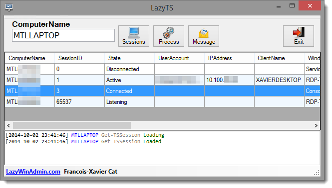

LazyTS
======
LazyTS is a PowerShell script to manage Sessions and Processes on local or remote machines. It allows you to Query/Disconnect/Stop session(s), Query/Stop process(es) and Send Interactive message to one or more sessions.

This tool is using the module PSTerminalService which relies on the Cassia .NET Library.I used Sapien PowerShell Studio 2014 to which make life easier if you want to start building WinForms tools and add PowerShell code.

## Requirements

* PowerShell 3.0
* Cassia Library (included in the download)

LazyTS is relying on the Cassia .NET Library (A DLL file). This file need to be present in the same directory as the script (Either when you use the PS1 or EXE file)

Of course you also need the appropriate permission on the remote machine to be able to manage it.
If the Cassia.dll is not present, the script won't start:

## Installation

* Download the last version: https://github.com/lazywinadmin/LazyTS/releases
* Unblock the zip file
* Extract all the files
* Launch LazyTS.ps1

## Usage

* Launch a PowerShell console with the account that will perform the action
* Execute the powershell script LazyTS.ps1

## Main features

### Querying session on local or remote machines

After entering the ComputerName, click on the button Sessions

### Disconnecting Session(s)

Select one session or multiple sessions and right click, click on Disconnect Session
This will only disconnect the user, its session State will become "disconnected", but will remain opened on the host.

")

When getting disconnected, the user will get the following window

<i>Your Remote Desktop Services session had ended.
Your network administrator might have ended the connection. Try connection again, or contact technical support for assistance</i>

### Stopping a Session(s)

Select one session or multiple sessions and right click, click on Stop Session
This will close the session of the user without warning. Any current work in progress will be lost.

")

Here is the confirmation window after you select "Stop Session"

### Querying Processes

After entering the ComputerName, click on the button Process.
This will list all the running processes (for all sessions)

### Stopping Process(es)

Select one process or multiple processes and right click, click on Stop Process
This will Stop the process(es) selected.

")

/Confirmation")

### Sending Message(s)

After entering the ComputerName, click on the button Message.
Note that you must select one session or one process in order to use this option (the script need to know which session(s) it should send the message to.

This will Send a message to the selected session. If multiple sessions are selected only one message will be sent to each session.

")

Confirmation windows:

/confirmation")

Default message: "IMPORTANT: The Server is going down for maintenance in 10 minutes. Please save your work and logoff."

Message to send

/Message to send")

#### Example of message received by each session selected

### Remote Desktop: Shadow (since v1.1)

When right clicking on a row you'll have the possibility to open a Shadow RDP on a selected Session ID. After you request to View or Control the session, the user will get this message

<i>"<Domain>\<samaccountname> is requesting to control your session remotely. Do you accept the request"
Message showed to the user when trying to control his session id.</i>

If the user deny the request, you'll get the following message

"The operator or administrator has refused the request"
